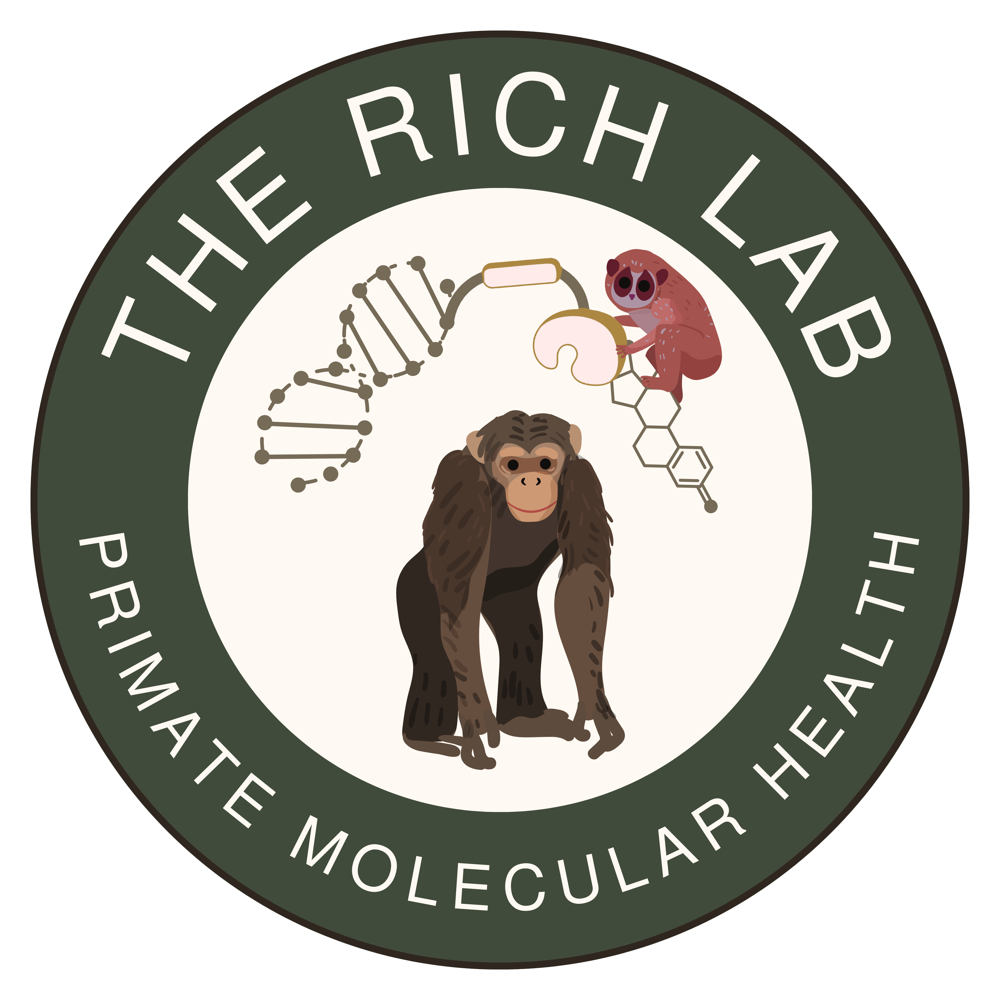

<!-- README.md is generated from README.Rmd. Please edit that file -->

# zoolabs 

<!-- badges: start -->

[](https://github.com/Rich-Molecular-Health-Lab/zoolabs/actions/workflows/R-CMD-check.yaml)
<!-- badges: end -->

`zoolabs` is a teaching package for **Zoo Biology students at the
University of Nebraska Omaha**, designed and maintained by Dr. Alicia
Rich.

This package includes all the **functions, datasets, color palettes,
interactive tables, and plotting tools** needed to complete population
management lab modules using R. It also supports `learnr` tutorials and
Shiny-based apps for interactive learning.

## Features

- **Pedigree visualization** with `pedtools` and `visNetwork`
- **Population viability metrics** including lambda, life tables, and
  kinship
- **Interactive demographic tables** using `reactable`
- **Standardized color palettes** for sex, status, and location
- 📦 Supports `learnr` modules, R Markdown labs, and Shiny apps

## 🚀 Installation

### If you have not used this package yet

Install **`zoolabs`** on your local `R Studio` by running the following
from the console:

``` r
install.packages("pak")
```

Then run this from the same console:

``` r
pak::pak("Rich-Molecular-Health-Lab/zoolabs")
```

### After installing for first use

Load the package each time you want to use a lab tutorial in your
session by copying and pasting the following into your console:

``` r
library(zoolabs)
```

### Extra Hint

Here is a screen grab of what the console will look like after you run
each of these code chunks the first time:


## Usage

Once installed, you’ll be able to:

- Use all core functions like `plot_census()`, `lifeTab()`, and
  `ped_network()`
- Load demo data like `studbook.tsv` via `system.file()`
- Launch `learnr` tutorials using:

### To load the PopData Lab Tutorial

Copy and paste the following into your console (after loading the
`zoolabs` package above):

``` r
learnr::run_tutorial("popdata", package = "zoolabs")
```

## Resources

- Course Site:
  [rich-molecular-health-lab.github.io](https://github.com/Rich-Molecular-Health-Lab/rich-courses)
- Issue Tracker: [GitHub
  Issues](https://github.com/Rich-Molecular-Health-Lab/zoolabs/issues)
- Maintainer: [Alicia Rich](mailto:aliciarich@unomaha.edu)

## License

This project is licensed under the **GPL-3** license.

------------------------------------------------------------------------

*This package is intended for educational use by UNO students enrolled
in BIOL 4130: Zoo Biology.*
