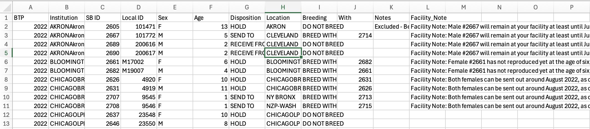
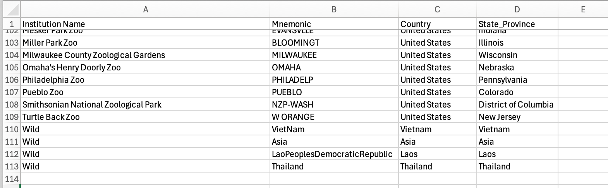

```{r setup, include=FALSE}
library(conflicted)
library(here)
library(knitr)
library(learnr)
library(paletteer)
library(shiny)
library(tidyverse)
library(zoopop)
knitr::opts_chunk$set(
  collapse = TRUE,
  message  = FALSE,
  warning  = FALSE,
  echo     = TRUE,
  include  = TRUE,
  eval     = TRUE,
  comment  = ""
)
conflicts_prefer(lubridate::interval)
conflicts_prefer(dplyr::filter)
i_am("inst/tutorials/new_studbook/new_studbook.Rmd")
```


## Introduction

### Goal

This tutorial will walk through the steps to create a tidy and complete studbook file that works well with other functions included in this package.

### Background

Zoo data tends to be shared and published in formats that are designed to only work within proprietary software programs and database systems. These are often held behind steep pay walls and sacrifice flexibility and reproducibility for a point-and-click user-interface. Because our lab frequently works with samples collected from zoo animals, we found it useful to design a reproducible workflow to start with published Animal Programs reports and finish with complete and tidy datasets that provide the full range of flexibility and reproducibility we need to manipulate and interpret our data in R.

### Caveat

1.  So far, we have only designed this to work with the standard formats that the Pygmy Slow Loris Provisional SSP reports use. Eventually I plan to update this package to make sure the code works well with some of the different variations I have seen in report organization and syntax for other Animal Programs.

2.  It seems that, as of ~2023, most SSP Directors began publishing Studbooks with only the living population data. This workflow, therefore, merges two separate Studbook publications and coalesces data for all individuals represented. We may have to start reaching out to Studbook Keepers and SSP Directors in the future if we want to dig up the historic records for other taxa. (*Unless they go back to publishing complete studbooks again!* &#129310)

## Data Preparation

### Studbook

1.  Use Adobe Acrobat or another program to extract the pages of the published pdf file containing the studbook tables.

2.  Export those extracted pages as an excel file.

3.  Repeat this for all versions you want to merge.
  
4.  Perform some minimal editing of the file in excel to ensure you have the following column names in the exact spelling/syntax shown:

  - `ID`, `Sex`, `Sire`, `Dam`, `Birth_Type`, `Event`, `Date`, `Location`
  - Make sure you remove the merging of any cells, and if you see any obvious formatting issues you can correct them, but the `read_studbook` function should do most of the work of removing extraneous header rows and extra characters so long as you start with the properly named column headings above.

5.  Copy and paste the rows from each excel file you created so that they all appear in a single csv file with the same headings.

  - It is fine if the data contain duplicated rows and entries - the workflow will check for redundancy or necessary corrections as it moves from year to year.

4.  Save the studbook file as a `.csv` and add it to a data path you can access for this script.

### BTP

1.  Repeat the same Adobe Acrobat to excel process for any published Breeding and Transfer Plans you have on hand. It is important that you at least include the most recently published version, which will help us update the inclusion/exclusion of individuals in the effective population, among other things.

2.  This time, when you convert from pdf to excel, you will have to do some more tedious editing to ensure row-wise data organization.

  - Again, if you are merging multiple BTPs, copy and paste them one after the other and make sure the data share column headings. Do not worry about duplication.

3.  Make sure the final `.csv` file that you create contains the following column headings:

  - `BTP`, `Institution`, `SB ID`, `Sex`, `Age`, `Disposition`, `Location`, `Breeding`, `With`, `Notes`, `Facility_Note`
  - Note that `BTP` is a column you will create by hand. This should be the 4-digit year of the BTP's publication corresponding to that row (in my case, the first half of my rows contain the value `2025` in the `BTP` column, and the second half contain `2022`.)
  - `Institution` is organized into rows in these reports, so you need to create a column that repeats the complete string representing the institution:
    - e.g., `AKRON Akron Zoological Park Akron, OH`.
    
4.  Here is a screenshot of what my `csv` table looks like:



### Institutions

1.  Repeat the same studbook pdf to csv workflow for the pages from the studbook reports that contain the list of institutions.

2.  Merge all lists under the following column headings:

  - `Institution Name`, `Mnemonic`, `Country`, `State_Province`
  - You may need to do some editing by hand to ensure each row contains a value for Country and State_Province. If you don't plan on using State/Province for any visualizations, then you can simply copy and paste the Country into this column.

3.  Add rows to this file as you process the other files so that any locations appearing in your studbook also have a matching string under the `Mnemonic` column in this file. You can repeat the chunk of code that reads and processes the file each time you add another location. At a minimum, you will need to do this for the misc. wildborn locations named throughout the historic studbook data (see screenshot for example.)



### Summary

Now you have all three files that you need to perform the rest of the data wrangling and tidying using the workflow in this tutorial. Here are the names that I give to each file:

- `studbook_original.csv`, `locations_original.csv`, `btp_original.csv`

## Process Data

### Institutions

*Note that this code will automatically export an updated version of the dataset to the second path provided as a parameter.*

```{r}
locations <- read_locations(here("inst/extdata/locations_original.csv"), 
                            here("inst/extdata/locations.csv"))
```

### Breeding and Transfer Plans

*Note that this code will automatically export an updated version of the dataset to the second path provided as a parameter.*

```{r}
btp <- read_btp(here("inst/extdata/btp_original.csv"),
                here("inst/extdata/btp.csv"), locations)
```

### Studbook

For this function we can optionally assign values to a column `name_spec` for just some individuals we will want to highlight in different tables and figures. Any individuals not mentioned will present empty cells for that column, and if nothing is assigned then all rows will be empty values for this column.\
\
In our case, we want two subjects to stand out, so we will give them a name value for the `name_spec` column formatted as a vector as shown below.

```{r}
names     <- c(Culi = "2652", Warble = "2677")
```

\
We can also account for any new births that are implied but not documented in the dataset using the optional parameter `add_births`. This should be provided as a list in the example list called `new_births` shown below.

```{r}
new_births <- list(
  "2024-06-01" = list(
  ID   = 2738,
  Sire = 2622,
  Dam  = 2630
))
```


```{r}
studbook  <- read_studbook(
  here("inst/extdata/studbook_original.csv"), 
  locations, 
  btp, 
  names      = names,
  add_births = new_births
  )
```

### Fill Missing Parentage

I created the function below to assist with scanning the studbook for missing Sire or Dam values for non-founders. It will produce a list of tibbles named by the individuals' ID. Each row of the tibble represents all males (if searching sires) or females (if searching dams) present at their birth institution during their birth year. Use this to screen for likely paternity/maternity assignments.

```{r}
missing_dads <- find_parent(studbook, locations, "sire")
missing_moms <- find_parent(studbook, locations, "dam")
```

The list used for the `add_all_hypotheticals` function includes all individuals still missing a parental assignment. It will create hypothetical rows of data and ID's as placeholders in the studbook for optimal functioning with pedigree-based R packages/analyses. The function returns a version of the original studbook with these new rows and the parental assignments included.

```{r}
hyp_defs <- list(
  sires = list(
    c(1045, 1046), 
    2108, 
    c(2423, 2424),
    2717),
  dams  = list(2717)
  )
```


```{r}
studbook_revised <- studbook %>%
  mutate(Sire = case_match(ID, 
                           1047 ~ 1012, 
                           .default = Sire)) %>%
  add_all_hypotheticals(hyp_defs, locations)
```

Now we will export this version of the studbook as a csv file that we can use for other workflows and functions in this package.

```{r}
write_csv(studbook_revised, here("inst/extdata/studbook.csv"))
```


